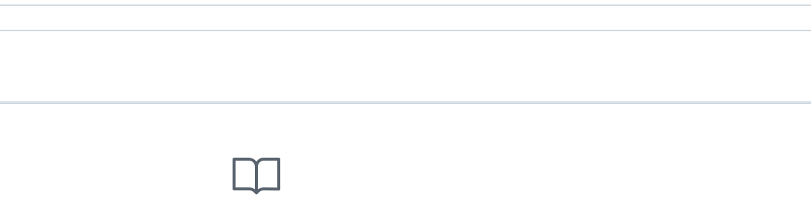

## Dublin Bikes Mapper – Smart Bike Monitoring & Prediction Platform

### Project Overview

This project presents a comprehensive web-based system designed for Dublin’s public bike-sharing network. It integrates real-time data from bike stations, weather and air quality APIs, and applies machine learning models to forecast future bike availability. 

We first collected two months of historical data on bikes and weather conditions. The data was preprocessed and used to train models that forecast future bike and stand availability. We then developed the core application features and subsequently deployed the system on an AWS EC2 instance, with data stored and managed in an AWS RDS database. On the server, background services continuously run—scrapers fetch the latest real-time data, and a scheduled prediction module regularly updates the machine learning forecasts displayed on the website.

**Initially developed by a team of three—Sha Luo, Yanwen Yu, and Thomas Pollock—as part of an academic Agile-based collaboration, the project was taken offline after submission. It was later independently revived, restructured, and redeployed by Sha Luo on EC2 and RDS.  As a core contributor, my responsibilities included full-stack development and deployment. A detailed breakdown of my contributions is provided in the final section of this document.**

---

### Website

[http://dublinbikes.site](http://dublinbikes.site)

---

###  Tech Stack

- **Frontend**: React + Vite + TypeScript (Google Maps Platform, Google Charts)
- **Backend**: Spring Boot (Java, RESTful API)
- **Scrapers**: Python (requests, schedule, dotenv)
- **Model Training**: Python (scikit-learn Random Forest, Jupyter notebooks / scripts for model training)
- **Predictor**: Python + Flask microservice (serving the trained Random Forest model)
- **Database**: AWS RDS (MySQL)
- **Deployment & Infrastructure**: Docker, Docker Compose, Nginx, GitHub Actions (CI/CD), AWS EC2 (Hosting), Namecheap (Domain & DNS)

---

###  Project Structure

```
dbbikes/
├── app/
│   ├── ml/                   # Scripts for applying ML models to generate predictions
│   ├── ML_models/            # Saved ML model files (.joblib)
│   ├── scraper/              # Data scrapers for weather, air quality, stations etc.
│   ├── static/               # Front-end static files (CSS, JS, images)
│   ├── templates/            # HTML templates for Flask rendering
│   ├── app.py   。             # Main Flask application entry point
│   ├── config.py             # Configuration loader from .env
│   └── .env                  # Environment variables (excluded from Git)
├── notebooks/                # Jupyter notebooks used for ML model training and preparation
├── requirements.txt          # Python dependency list
├── .gitignore                # Git ignore rules
└── README.md                 # Project overview and instructions
```

---

### Key Features

#### **● Displaying all the bike stations in Dublin**

Upon loading the website, all Dublin bike stations are displayed on the map, providing users with a clear overview of their distribution. Clicking on a station marker reveals an info box with key details, including station name and number, status, total capacity, real-time bike and stand availability, credit card support.


#### ● **Machine Learning Prediction feature for Bikes and Stands**

When users click the “ML Availability Prediction” button on a selected station, the system displays bar charts forecasting the number of available bikes and stands over the next four days, helping users plan future trips.


#### **● Weather forecast feature**

The top-left widget displays current weather conditions. Clicking it reveals 24-hour forecast charts for temperature and wind speed.


#### **● Real-Time Bike & Stand Distribution**

Users can toggle between "Bikes Avail" and "Stands Avail" views to display the real-time availability of bikes or bike stands across all stations. Availability is represented by colored circles on the map, where size indicates quantity and color reflects availability levels. A legend in the top-left corner provides reference.


#### **● Route Planning Between Stations**

Users can select any two bike stations — one as the departure point and one as the destination — to generate a suggested cycling route between them. 



