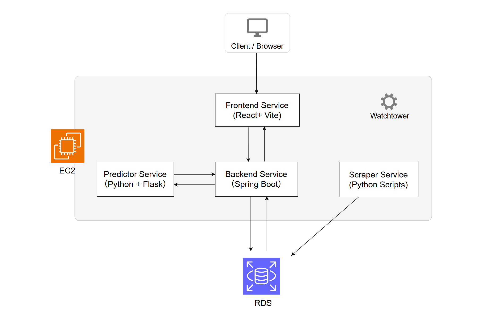
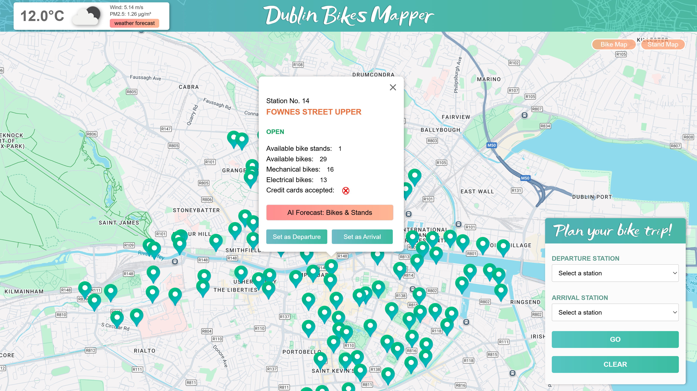
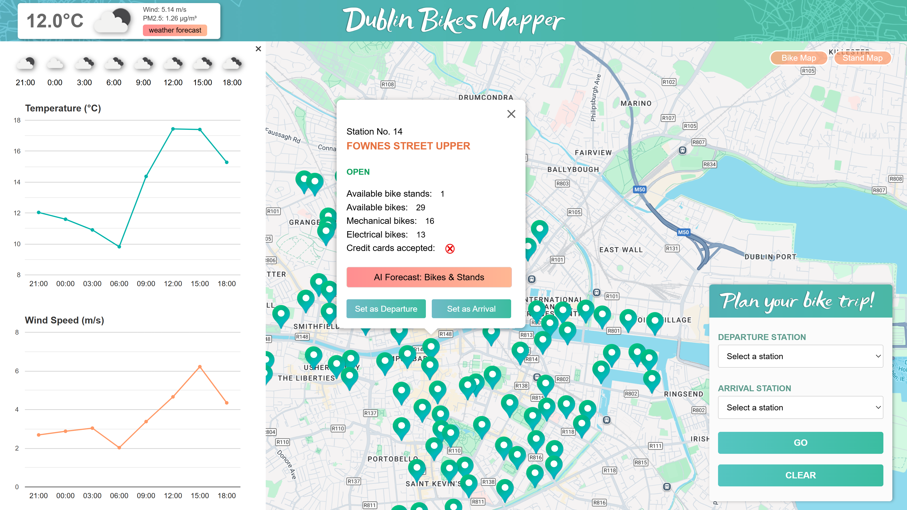
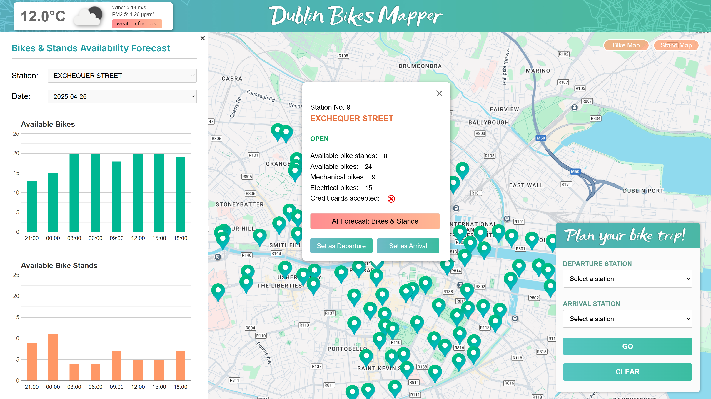

## Dublin Bikes Mapper – Smart Bike Monitoring & Prediction Platform

### Live Demo

[http://dublinbikes.site](http://dublinbikes.site)

------

### Project Overview

This project delivers a comprehensive web-based system for monitoring and predicting the availability of Dublin’s public bike-sharing network. It integrates real-time data from bike stations, weather APIs, and air quality APIs, combined with machine learning models to forecast future bike and stand availability.

To support model training, I first collected two months of historical data on bike usage and weather conditions. Live data was continuously collected from the JCDecaux API (for real-time bike station availability) and the OpenWeatherMap API (for current weather and forecasts). After processing and cleaning the collected data, I trained a Random Forest model using scikit-learn. Subsequently, I developed related functionalities in both the frontend and backend.

The platform adopts a microservices architecture, with separate services for scraper, predictor, backend and frontend. It is fully containerized with Docker, deployed on AWS EC2, and uses an AWS RDS MySQL database for persistent storage. CI/CD automation is managed via GitHub Actions.

------

###  Tech Stack

- **Frontend**: React + Vite + TypeScript , Google Maps Platform, Google Charts
- **Backend**: Spring Boot (Java, RESTful API) + Maven (build & dependency)
- **Scrapers**: Python (requests, schedule, dotenv)
- **Predictor**: Python + Flask  (serving the trained Random Forest model)
- **Database**: AWS RDS (MySQL)
- **Deployment & Infrastructure**: Docker, Docker Compose, Watchtower (auto update), Nginx, GitHub Actions (CI/CD), AWS EC2 (t4g.small), Namecheap (Domain & DNS)
- **Model Training**: Python (scikit-learn Random Forest, Jupyter notebooks / scripts for model training)

---

### System Architecture

The system adopts a microservices-based architecture, consisting of the following independent services:

- **Frontend Service** (React + Vite): Visualizes live station data, weather information, and prediction results using Google Maps and Google Charts.
- **Backend Service** (Spring Boot): Periodically collects real-time station and weather data, stores it in the database, and provides RESTful APIs to the frontend. It also retrieves machine learning predictions from the Predictor Service, acting as the central coordinator between different system components.
- **Predictor Service** (Python + Flask): Hosts the trained Random Forest model and provides real-time prediction endpoints. Considering that the model may be updated frequently, this service is designed as an independent module, implemented with Flask and Python to ensure both model compatibility and flexible maintenance.
- **Scraper Service** (Python Scripts): Periodically collects historical station and weather data from the JCDecaux and OpenWeatherMap APIs. Designed as an independent service to support machine learning model training, it can be started, stopped, or restarted without impacting other system components.

Each service runs in its own Docker container, orchestrated with Docker Compose for simplified deployment, scaling, and maintenance. To support continuous deployment, the host integrates **Watchtower**, which automatically monitors container images, pulls updates when available, and restarts services with minimal downtime.

In addition to the services, the platform relies on a centralized database component:

- **AWS RDS MySQL**: Provides reliable and scalable persistent storage for all application data.

---

### Key Features

#### **● Displaying all the bike stations in Dublin**

Upon loading the website, all Dublin bike stations are displayed on the map, providing users with a clear overview of their distribution. 

#### ● Station Info Box on Click

Clicking on a station marker reveals an info box with key details, including station name and number, status, total capacity, real-time bike and stand availability, credit card support.

#### **● Weather forecast feature**

The top-left widget displays current weather conditions. Clicking the button on it  reveals 24-hour forecast charts for temperature and wind speed.

#### ● **AI forecast feature for bikes and stands**

When users click the “AI Forecast” button on a selected station, the system displays bar charts forecasting the number of available bikes and stands over the next four days. Users can select different stations and dates from the left panel to view the forecasted availability of bikes and stands, helping them plan future trips more effectively.

#### **● Real-Time Bike & Stand Distribution**

Users can toggle between "Bikes Map" and "Stands Map" buttons to display the real-time availability of bikes or bike stands across all stations. Availability is represented by colored circles on the map, where size indicates quantity and color reflects availability levels. A legend in the top-right corner provides reference.

#### **● Route Planning Between Stations**

Users can select any two bike stations — one as the departure point and one as the destination — to generate a suggested cycling route between them. 

------

### License

This project is licensed under the CC BY-NC-ND 4.0 License. See the [LICENSE](./LICENSE) file for details.
